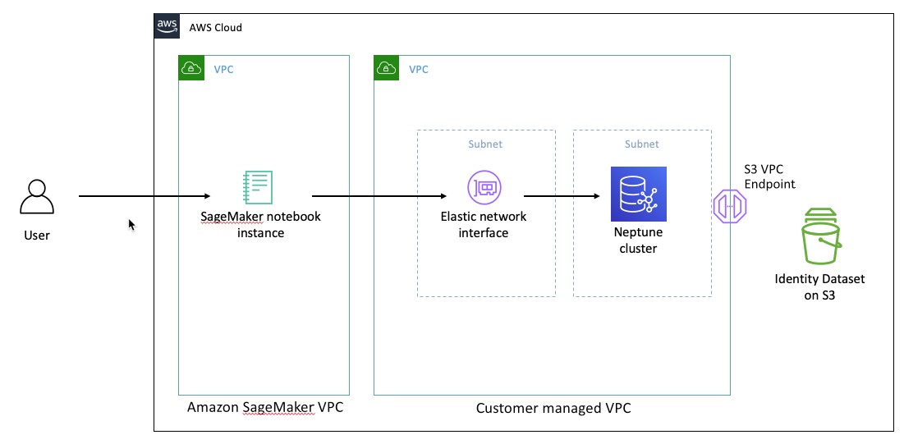
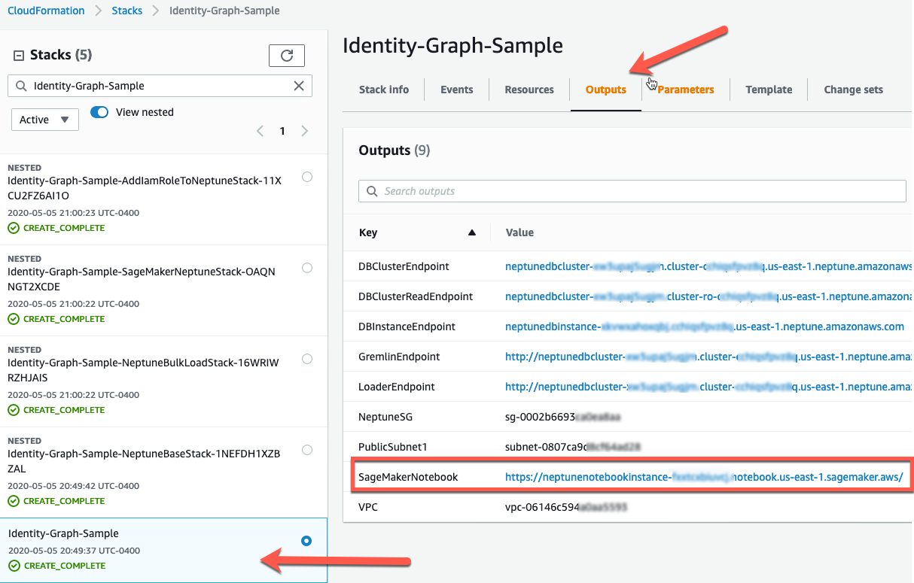

# Identity Graph Using Amazon Neptune

An identity graph provides a single unified view of customers and prospects by linking multiple identifiers such as cookies, device identifiers, IP addresses, email IDs, and internal enterprise IDs to a known person or anonymous profile using privacy-compliant methods. Typically, identity graphs are part of a larger identity resolution architecture. Identity resolution is the process of matching human identity across a set of devices used by the same person or a household of persons for the purposes of building a representative identity, or known attributes, for targeted advertising.

The following notebook walks you through a sample solution for identity graph and how it can be used within a larger identity resolution architecture using an open dataset and the use of a graph database, Amazon Neptune. In this notebook, we also show a number of data visualizations that allow one to better understand the structure of an identity graph and the aspects of an identity resolution dataset and use case. Later in the notebook, we expose some additional use cases that can be exposed using this particular dataset.

## Getting Started

This repo includes the following assets:
- A [Jupyter notebook](notebooks/identity-resolution/identity-graph-sample.ipynb) containing a more thorough explanation of the Identity Graph use case, the dataset that is being used, the graph data model, and graph queries that are used in deriving identities, audiences, customer journeys, etc.
- A [sample dataset](data/DATA.md) comprised of anonymized cookies, device IDs, and website visits.  It also includes additional manufactured data that enriches the original anonymized dataset to make this more realistic.
- A set of [Python scripts](notebooks/identity-resolution/nepytune) that are used within the Jupyter notebook for executing each of the different use cases and examples.  We're providing the code for these scripts here such that you can extend these for your own benefit.
- A [CloudFormation template](templates/identity-resolution.yml) to launch each of these resources along with the necessary infrastructure.  This template will create an Amazon Neptune database cluster and load the sample dataset into the cluster.  It will also create a SageMaker Jupyter Notebook instance and install the scripts and sample Jupyter notebook to this instance for you to run against the Neptune cluster.

### Architecture

### Quickstart

To get started quickly, we have included the following quick-launch link for deploying this sample architecture.

| Region | Stack |
| ---- | ---- |
|US East (Ohio) |   |
|US East (N. Virginia) |   |
|US West (Oregon) |   |
|EU West (Ireland) |   |

Once you have launched the stack, go to the Outputs tab of the root stack and click on the SageMakerNotebook link.  This will bring up the Jupyter notebook console of the SageMaker Jupyter Notebook instance that you created.

Once logged into Jupyter, browse through the Neptune/identity-resolution directories until you see the identity-graph-sample.ipynb file.  This is the Jupyter notebook containing all of the sample use cases and queries for using Amazon Neptune for Identity Graph.  Click on the ipynb file.  Additional instructions for each of the use cases are embedded in the Jupyter notebook (ipynb file).

## License Summary

This library is licensed under the MIT-0 License. See the LICENSE file.
